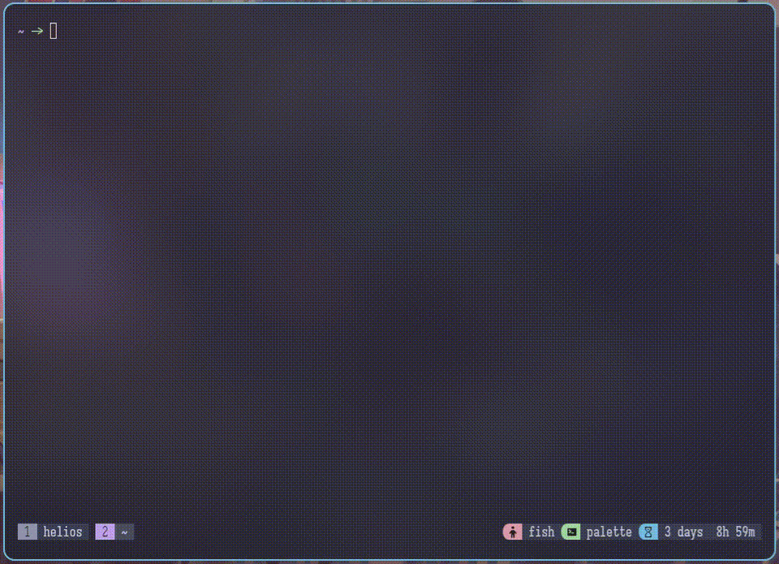
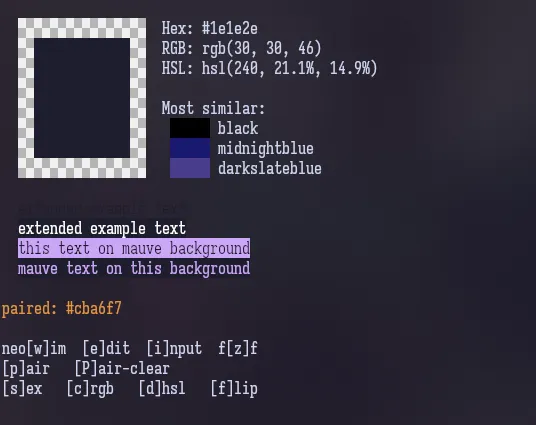

# palette

A tmux & pastel based colour palette manager for fish shell. Browse, tweak,
save, and copy colours interactively using a three-pane tmux layout with live previews.

This was inspired by [@Axlefublr](https://github.com/Axlefublr)'s
[`coloring-book.fish`](https://github.com/Axlefublr/dotfiles/blob/main/lai/coloring-book.fish),
with all the nushell/nuson replaced with json. Her implementation is very clean
and simple with it just being an inline script, but i wanted a little more control
over how i interacted with it, like making the fzf menu stay on screen,
so i made this!


## Dependencies

| Tool                                                    | Purpose                                                                        |
| ------------------------------------------------------- | ------------------------------------------------------------------------------ |
| [fish](https://fishshell.com/)                          | Scripting runtime and interactive shell                                        |
| [tmux](https://github.com/tmux/tmux)                    | Terminal multiplexer. Provides the three-pane layout                           |
| [pastel](https://github.com/sharkdp/pastel)             | Colour manipulation and previews (format conversion, brightness, rotate, etc.) |
| [jq](https://jqlang.github.io/jq/)                      | JSON processing for the colour data file                                       |
| [fzf](https://github.com/junegunn/fzf)                  | Fuzzy finder. Used for colour selection and pair picking                       |
| [wl-clipboard](https://github.com/bugaevc/wl-clipboard) | Wayland clipboard (`wl-copy`) for copying rgb, hex, or hsl values              |

> [!NOTE]
> `wl-clipboard-rs` (a rust reimplementation) also works.

> [!WARNING]
> palette uses `wl-copy` for clipboard operations and is wayland specific.  
> If you're on x11 you can substitute `xclip -selection clipboard` in the script,
> or use `wl-clipboard` via a compatibility layer.

## Quick Start

```fish
# Source the palette functions
source /path/to/palette/palette.fish

# (Optional) point to your own colour file
set -gx PALETTE_FILE $HOME/.config/palette/my-colours.json

# Launch the palette
palette
```

The first time you run `palette`, it will create `~/.palette.json` if it doesn't
exist (it needs at least an empty array `[]`).

### NixOS Users

This repo comes with a `shell.nix` for you to use to test the program before
installing it proper.  
Clone this repo, then run

```nix
nix-shell
```

This comes loaded with `tmux`, `pastel`, `fish`, `fzf`, `jq`, and `wl-clipboard-rs`,
and sets `PALETTE_FILE=./test-palette.json`

## How It Works

`palette` creates a three-pane tmux layout from the current pane:



- **Browse:** move through the fzf list in the bottom pane. The preview pane
updates live.
- **Select:** press Enter on a colour name to enter command mode, or on
"Enter a new color" to start from a random hex.
- **Command mode:**  copy values to clipboard; pair with another colour; open
the JSON file in `$EDITOR`, enter Edit Mode.

- **Edit mode:** adjust hue, saturation, lightness, RGB channels, then
write (save) the colour to your palette file.
<video src="images/editing-new-demo.mp4" controls muted loop>
  
</video>
- **Pair Mode:** pick a colour from the palette to use as a reference/pair


When you press `z` in command or edit mode, focus returns to the fzf picker.
> [!WARNING]
> If you press `z` before saving, you WILL lose the unsaved edits.  
> This program does not keep working copies of colours.

## Key Bindings

### Command mode (after selecting a colour)

| Key       | Action                                                       |
| --------- | ------------------------------------------------------------ |
| `w`       | Open the palette JSON file in `$EDITOR`                      |
| `e`       | Enter [edit mode](#edit-mode) (adjust channels, then save)   |
| `i`       | Input a hex value directly (`#RRGGBB`), then enter edit mode |
| `z`       | Return to the fzf colour picker                              |
| `s`       | Copy hex (`#rrggbb`) to clipboard                            |
| `c`       | Copy RGB (`rgb(r, g, b)`) to clipboard                       |
| `d`       | Copy HSL (`hsl(h, s%, l%)`) to clipboard                     |
| `f`       | Flip to complementary colour                                 |
| `p`       | Pick a pair colour from the palette via fzf                  |
| `P`       | Clear the paired colour                                      |

### Edit mode

| Key       | Action                                                         |
| --------- | -------------------------------------------------------------- |
| `w`       | Save the current colour to the palette file                    |
| `e`       | Exit edit mode, return to command mode (doesnt delete changes) |
| `z`       | Return to the fzf colour picker (no save, can delete changes)  |
| `r` / `R` | Increase / decrease red channel                                |
| `g` / `G` | Increase / decrease green channel                              |
| `b` / `B` | Increase / decrease blue channel                               |
| `j` / `J` | Rotate hue forward / backward                                  |
| `l` / `L` | Lighten / darken                                               |
| `k` / `K` | Saturate / desaturate                                          |

### Save behaviour

- If you edited an **existing named colour**, pressing `w` shows
`Overwrite "name"? [y/Name]`. Type `y` to overwrite, or type a new name to
save as a different entry.
<video src="images/editing-overwrite-demo.mp4" controls muted loop>
  
</video>
- If you used `i` (input hex) or selected **"Enter a new color"**, pressing `w`
prompts `Name:` directly.
<video src="images/editing-random-demo.mp4" controls muted loop>
  
</video>
- If you type a name that already exists while saving a new colour, the existing
entry is overwritten (the JSON is updated in-place, not duplicated).

## Configuration

### `$PALETTE_FILE`

Path to the colour data file. The file must be a JSON array of `[name, hex]` pairs:

```json
[
  ["tomato",  "#dc4532"],
  ["sky",     "#7ec8e3"],
  ["moss",    "#5a7d3a"]
]
```

Default: `$HOME/.palette.json`

You can set this before sourcing `palette.fish`, or export it per shell:

```fish
set -gx PALETTE_FILE $HOME/project/colours.json
```

If the file doesn't exist, the palette will start with an empty colour list.  
Make sure it exists and contains at least `[]` before launching.

### `$EDITOR`

Used by the `w` key in command mode. If unset, fish's default editor is used.

## Installation (persistent)

To make `palette` always available, add to your `~/.config/fish/config.fish`:

```fish
source /path/to/palette/palette.fish
```

Or add the repository directory to `fish_function_path`:

```fish
set -U fish_function_path /path/to/palette $fish_function_path
```

(Note: the function path approach only works if you split each function into
its own file named after the function. The current distribution uses
a single sourceable file.)

## Project Structure

```
palette/
├── palette.fish          # Sourceable fish script. defines all functions
├── palette-inline.fish   # Self-contained script run in the preview tmux pane
├── shell.nix             # A full nix-shell for nix users
├── test-palette.json     # A palette with some basic colours.
└── README.md             # This file
```

The two `.fish` files are independent:

- **`palette.fish`** — source this once in your shell. It defines the `palette`
function (entry point) and all internal helpers.
- **`palette-inline.fish`** — not sourced directly. The `palette` function
copies it to a temp directory and launches it in a dedicated tmux pane with the
necessary environment variables.

## Quirks

### JSON format

The palette file is stored as a **flat array of arrays**, `[["name", "#hex"], ...]`,
not a JSON object. This keeps ordering predictable and makes `jq` transforms
simpler. Editing the file by hand is fine; just maintain the same structure.

### tmux required

The palette uses tmux for its three-pane layout and pane-to-pane IPC via temp
files. It won't work in a plain terminal without tmux. If you want a standalone
version without tmux, see the inspiration listed in the header.

### Clipboard: Wayland only

Clipboard operations use `wl-copy` from `wl-clipboard` or `wl-clipboard-rs`.  
No X11 clipboard fallback is included.

### Cleanup

The `palette` function creates temp files in `/tmp/` with names like
`palette-*.XXXXXX`. These are cleaned up when the function starts and exits. If palette
crashes or is killed, stale temp files may remain; they are harmless and will
be cleaned next time palette is run.

## Licence

MIT
